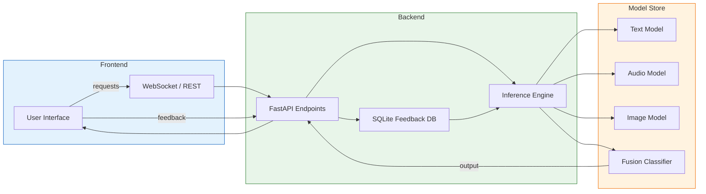
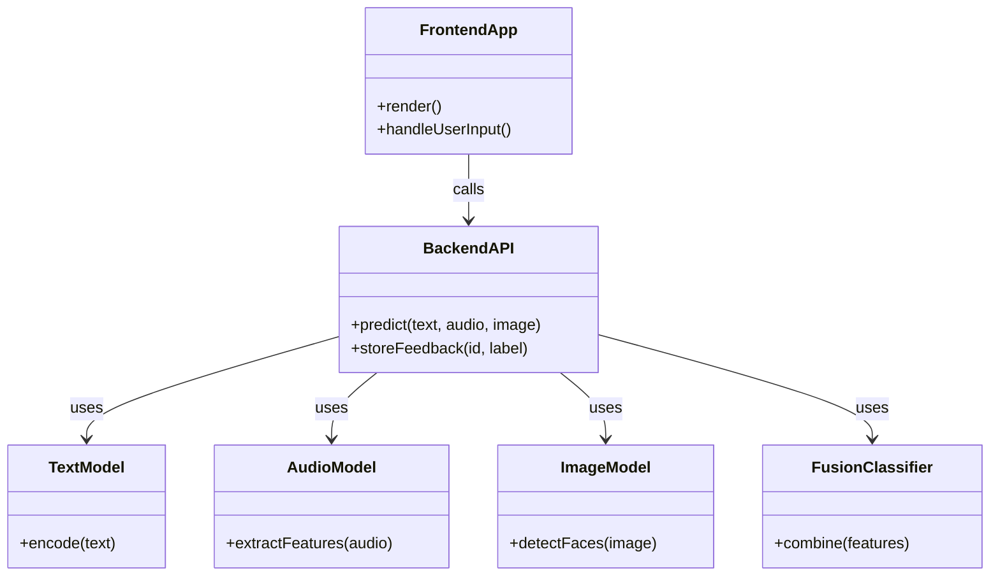
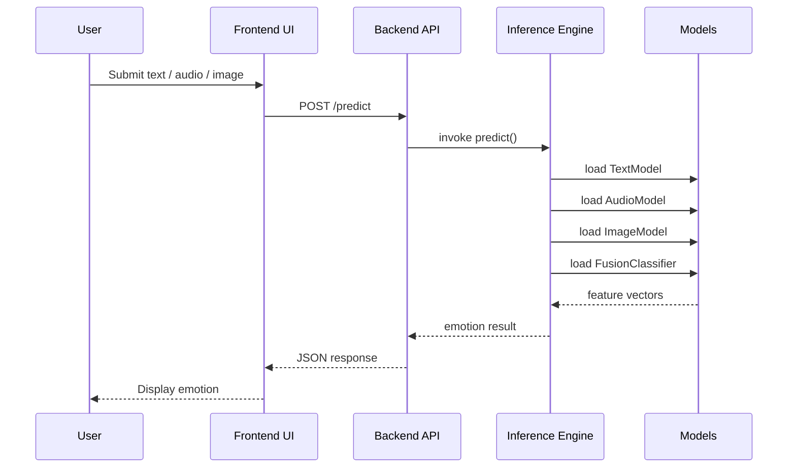

# EmotiCore Project Analysis Report

---

## 1. Problem Statement
Modern applications increasingly need to understand **human affect** from **text, speech, and facial cues** in real‑time. Existing solutions are typically **single‑modality**, lack integration, and are not optimized for low‑latency inference, making them unsuitable for interactive systems such as virtual agents, remote therapy, or real‑time analytics.

## 2. Abstract
**EmotiCore** is a multimodal emotion‑recognition platform that fuses textual, acoustic, and visual signals to provide a unified emotion inference API. It combines state‑of‑the‑art deep‑learning models, a feedback‑driven learning loop, and a lightweight, container‑based deployment architecture to deliver accurate, real‑time emotion detection across devices.

## 3. Proposed Solution
- **Multimodal Fusion**: Separate pretrained models for text, audio, and image are combined via a late‑fusion classifier.
- **Feedback Loop**: Users can correct predictions; corrections are stored in a SQLite DB and trigger periodic model retraining.
- **Containerised Backend**: FastAPI service packaged in Docker for reproducible, scalable deployment (Render, Hugging‑Face Spaces, local Docker).
- **Responsive Frontend**: React 18 + Vite UI with real‑time visualisations, 3‑D avatars (Three.js) and micro‑animations for premium UX.
- **Data Pipeline**: Scripts for downloading, preprocessing, and version‑controlling datasets (audio, image, text).

## 4. Architecture Overview
```
+-------------------+      +-------------------+      +-------------------+
|   Frontend (React|      |   Backend (FastAPI|      |   Model Store     |
|   + Vite)         |<---->|   + Uvicorn)      |<---->|   (Docker)        |
+-------------------+      +-------------------+      +-------------------+
        ^                         ^                         ^
        |                         |                         |
        |   HTTP/WS (REST)        |   Model Loading          |   Model Files
        |                         |                         |
        +-------------------------+-------------------------+
```

## 5. Tech Stack
- **Frontend**: React 18, Vite, Framer Motion, Three.js (`@react-three/fiber`), Recharts, Lucide‑React, Axios.
- **Backend**: Python 3.x, FastAPI, Uvicorn, PyTorch/TensorFlow, Hugging‑Face Transformers, DeepFace, OpenCV, Librosa, NumPy, Pandas, Scikit‑learn.
- **Infrastructure**: Docker, Render/Hugging‑Face Spaces, Git, CI/CD.
- **Data**: RAVDESS, TESS, CREMA‑D (audio); FER2013, CK+ (image); GoEmotions, MELD, ISEAR, SemEval‑2018 (text).
- **Storage**: SQLite (feedback), optional PostgreSQL for production.

## 6. Architecture Diagram (Mermaid)


## 7. Class Diagram (Mermaid)


## 8. Sequence Diagram (User Request → System) (Mermaid)


## 9. Verification Plan
1. **Render Check** – Open this markdown in a viewer that supports Mermaid (e.g., VS Code, GitHub) and confirm all diagrams display correctly.
2. **Content Review** – Verify each section reflects the current repository state (datasets, code, Dockerfile).
3. **User Confirmation** – Ask the user to confirm completeness or request additional sections/diagrams.

---
*If you need the report saved as a PDF, you can convert this markdown file using tools such as `pandoc` (`pandoc analysis_report.md -o analysis_report.pdf`) or any online markdown‑to‑PDF converter.*
